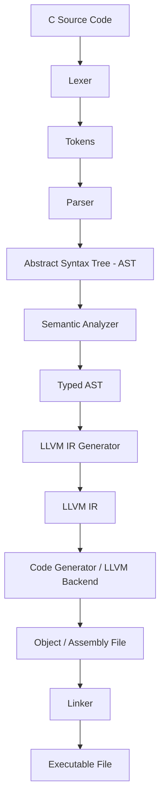

# CForge — Day 1: Architecture & Orientation

Welcome to **Day 1** of **CForge**, an educational C compiler built from scratch. Today's goal is to understand the end-to-end compiler pipeline and why compilers are structured as a series of modular stages.

---

## 1. Compiler Pipeline Stages



---

### Stage 1: C Source Code
* **What problem it solves**: Provides human-readable instructions in text form expressing program logic.
* **Input**: None (entry point into compiler).
* **Output**: Raw character stream (string of bytes from file, e.g. `int x = 42;`).
* **Why the next stage needs it**: The lexer needs characters as raw material to convert text into token streams.
* **Small Example**:
  ```c
  int add(int a, int b) {
      return a + b;
  }
  ```

---

### Stage 2: Lexical Analysis (Lexer / Scanner)
* **What problem it solves**: Strips away irrelevant characters (whitespace, comments) and groups raw characters into meaningful atomic units called **tokens**.
* **Input**: Raw C Source character stream.
* **Output**: A sequence of **Tokens** tagged with token types and source locations.
* **Why the next stage needs it**: The parser cannot operate efficiently on individual characters; it needs structured atomic lexical units (keywords, identifiers, operators, literals).
* **Small Example**:
  * Input string: `int x = 10;`
  * Tokens: `[KEYWORD_INT, IDENTIFIER("x"), ASSIGN, INT_LITERAL(10), SEMICOLON]`

---

### Stage 3: Parsing (Syntactic Analysis)
* **What problem it solves**: Validates that tokens follow the grammatical rules (syntax) of the C language and builds a hierarchical tree structure representing the program.
* **Input**: Token stream from the Lexer.
* **Output**: **Abstract Syntax Tree (AST)**.
* **Why the next stage needs it**: The semantic analyzer needs to navigate program structures (statements, expressions, function calls) in terms of their nested logical hierarchy, not a flat stream of tokens.
* **Small Example**:
  * For `x = 5 + 3`:
  * AST:
    ```
    AssignExpr
    ├── Target: Variable("x")
    └── Value: BinaryExpr(+)
               ├── Left: Literal(5)
               └── Right: Literal(3)
    ```

---

### Stage 4: Semantic Analysis
* **What problem it solves**: Enforces C language rules that cannot be checked by syntax alone (type checking, scope resolution, undeclared variables, const checking, function signature matching).
* **Input**: Unvalidated Abstract Syntax Tree (AST).
* **Output**: **Typed AST** (Decorated AST annotated with resolved types, symbol tables, and implicit casts).
* **Why the next stage needs it**: Code generation relies on knowing exact types, memory offsets, and variable declarations to produce accurate low-level instructions.
* **Small Example**:
  * Input: `float y = 5 + 3.14;`
  * Action: Detects `5` is `int` and `3.14` is `double/float`; inserts an implicit type conversion node `(float)5`.

---

### Stage 5: Intermediate Representation (LLVM IR Generation)
* **What problem it solves**: Translates high-level AST constructs into a target-agnostic, machine-independent low-level representation suitable for optimizations.
* **Input**: Typed AST.
* **Output**: **LLVM IR** (LLVM Intermediate Representation assembly code or bitcode).
* **Why the next stage needs it**: Isolates language-specific features from target architecture details, allowing LLVM's machine-independent optimization passes (dead code elimination, loop unrolling) to run before target assembly generation.
* **Small Example**:
  ```llvm
  %1 = load i32, i32* %a.addr
  %2 = load i32, i32* %b.addr
  %3 = add nsw i32 %1, %2
  ret i32 %3
  ```

---

### Stage 6: Code Generation (Target Backend)
* **What problem it solves**: Translates target-agnostic IR into hardware-specific machine instructions or assembly code for a specific target architecture (e.g., x86_64, ARM64).
* **Input**: (Optimized) LLVM IR.
* **Output**: **Assembly code (`.s`)** or relocatable **Object file (`.o` / `.obj`)**.
* **Why the next stage needs it**: The operating system and CPU understand binary instructions and relocation tables, which are contained in object files.
* **Small Example** (x86_64 assembly excerpt):
  ```assembly
  movl    -4(%rbp), %eax
  addl    -8(%rbp), %eax
  popq    %rbp
  retq
  ```

---

### Stage 7: Linking (Linker)
* **What problem it solves**: Combines multiple object files, resolves external symbol references (such as `printf` from C standard library `libc`), assigns final memory addresses, and outputs a complete runnable program.
* **Input**: One or more Object files (`.o`) + Libraries (`.a`, `.so`, `.lib`, `.dll`).
* **Output**: Executable binary file (e.g., `.exe` or ELF executable).
* **Why the stage is needed**: Resolves references between separate compilation units so the OS loader can load and execute the program in memory.
* **Small Example**:
  * Combines `main.o` and `math.o` with standard C library `libc.so` -> produces executable `a.out` / `app.exe`.

---

## 2. Why Divide a Compiler into Multiple Stages?

Compiling a high-level language directly into machine instructions inside a single monolithic function is practically impossible for real-world languages. Compilers use a multi-stage pipeline for four key architectural reasons:

### 1. Separation of Concerns & Complexity Management
Each stage handles exactly one logical transformation:
* Lexing handles **characters $\rightarrow$ words**.
* Parsing handles **words $\rightarrow$ grammar structure**.
* Semantic Analysis handles **meaning & types**.
* Code Generation handles **target hardware instructions**.

Tackling these concerns individually prevents exponential complexity.

### 2. Retargetability ($M \times N$ Problem)
If you want to support $M$ source languages (C, C++, Rust) across $N$ hardware architectures (x86, ARM, RISC-V):
* Without a common intermediate pipeline stage: You must write $M \times N$ distinct compilers.
* With a staged IR pipeline: You write $M$ frontends (Source $\rightarrow$ IR) and $N$ backends (IR $\rightarrow$ Target Machine). Total effort shrinks to $M + N$.

### 3. Reusable Optimization Passes
Machine-independent optimizations (constant folding, dead code elimination, loop vectorization) can be performed on the IR once, benefiting all source languages and target architectures without duplicating code.

### 4. Maintainability, Testability, and Debuggability
Modular pipelines make isolation testing trivial:
* You can test the Lexer by asserting token output given string inputs.
* You can test the Parser by checking AST nodes given token streams.
* You can dump intermediate representations (`--dump-ast`, `--emit-llvm`) to debug errors without needing to inspect hex machine code.
